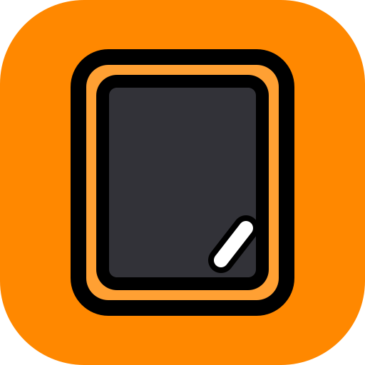

<h1 align="left">

<span style="vertical-align: middle;">Pala</span>
</h1>
[](LICENSE)
[](https://github.com/CsPS0/pala/releases)
[](https://github.com/CsPS0/pala/actions)

A **Pala** egy interaktív terminálos felhasználói felület (TUI) a Kréta e-napló rendszerhez. Az iOS alkalmazás OAuth2 hitelesítési folyamatait szimulálva közvetlen, gyors és látványos terminálos hozzáférést biztosít a diákok adatlapjához, jegyeihez, órarendjéhez és hiányzásaihoz.


## Főbb funkciók
- **Élő Dashboard (TUI felület)**
- **Böngésző Kiterjesztés (Chrome, Brave, Edge)**: Mini popup gyorsnézet visszaszámlálóval, heti mátrix vezérlőpulttal, Globális Profil Szerkesztővel és automatikus Kréta lap szinkronnal.
- **Pala Wrapped (Éves statisztika)**
- **Bizonyítvány Tervező & Szellem Jegyek**
- **Jegy-trendek & Átlagok**
- **Globális Haladó Kereső**
- *...és még több!*

## Böngésző Kiterjesztés (Browser Extension)

A Pala elérhető modern Chromium böngészőbővítményként is (Manifest V3) Chrome, Brave és Edge böngészőkhöz (`extension/` mappa):
- **Mini Gyorsnézet (Popup)**: 1 kattintásos eszközsori ablak mai órarenddel, hátralévő idővel és testreszabható kezdőlappal.
- **Teljes Vezérlőpult (Dashboard)**: Heti órarend mátrix, tantárgyi átlagok, Szellem-jegy kalkulátor, Bizonyítvány tervező, 250 órás hiányzáskeret, üzenetküldő és Profilom.
- **Kréta Munkamenet Védelem**: A hivatalos weboldal 40-60 perces időkorlátját a háttérben futó automatikus OAuth2 token frissítés (Silent Refresh) oldja fel.
- **Globális Profil Szerkesztő & API Korlátozás Kezelés**: A Kréta mobil API által nem szolgáltatott banki és okmány adatok manuális kezelése és 1-kattintásos beolvasása nyitott Kréta lapról.
- **Popup Testreszabása**: Megjelenítési sűrűség, alapértelmezett fül és kártyakorlátok beállítása közvetlenül a popupból vagy a vezérlőpultról.

## Telepítés

### 1. Windows Gyors Telepítés
- **Grafikus telepítő (.exe)**: Töltsd le a [Pala-Setup.exe](https://github.com/CsPS0/pala/releases/latest) fájlt (egyéni komponensválasztóval: Desktop GUI + CLI / TUI + PATH integráció).
- **PowerShell 1-soros**:
  ```powershell
  irm https://raw.githubusercontent.com/CsPS0/pala/main/install.ps1 | iex
  ```
- **Scoop**:
  ```powershell
  scoop bucket add pala https://github.com/CsPS0/pala-bucket
  scoop install pala
  ```

### 2. Linux & macOS Gyors Telepítés
- **Interaktív 1-soros telepítő (Bash)**:
  ```bash
  curl -fsSL https://raw.githubusercontent.com/CsPS0/pala/main/install.sh | bash
  ```

Ha manuálisan szeretnéd telepíteni vagy saját csomagkezelőt használsz:

   <details>
   <summary>Debian / Ubuntu / Linux Mint (APT)</summary>

> ```bash
> curl -fsSL https://CsPS0.github.io/pala/public.key | sudo gpg --dearmor -o /usr/share/keyrings/pala-archive-keyring.gpg
>
> echo "deb [signed-by=/usr/share/keyrings/pala-archive-keyring.gpg] https://CsPS0.github.io/pala/repo stable main" | sudo tee /etc/apt/sources.list.d/pala.list > /dev/null
>
> sudo apt update
> sudo apt install pala
> ```

   </details>

   <details>
   <summary>Arch Linux (AUR)</summary>

> ```bash
> yay -S pala-bin
> ```

   </details>

   <details>
   <summary>macOS (Homebrew)</summary>

> ```bash
> brew tap CsPS0/pala https://github.com/CsPS0/pala
> brew install pala
> ```

   </details>

   <details>
   <summary>Forráskódból történő fordítás</summary>

> [Dart SDK](https://dart.dev/get-dart) és [Flutter SDK](https://flutter.dev) szükséges.
> ```bash
> git clone https://github.com/CsPS0/pala.git
> cd pala
> dart pub get
> dart compile exe bin/pala.dart -o pala
> cd app && flutter build windows  # vagy linux / macos
> ```

   </details>

## Használat
A telepítés után a Pala közvetlenül indítható terminálból és a Start menüből:
```bash
pala
```

**Fő parancsok és kapcsolók:**
- `pala` : Interaktív terminálos TUI felület indítása.
- `pala --desktop` vagy `pala -g` : Pala Asztali Grafikus Alkalmazás (Desktop GUI) indítása.
- `pala dash` : Közvetlen belépés az Élő Dashboard nézetbe.
- `pala --demo` : Indítás beépített demó profillal (**Teszt Elek** - offline tesztadatok).
- `pala --daemon` : Háttérfolyamat indítása értesítésekhez.

**Komponens kezelés és rendszerintegráció:**
- `pala --install-shortcut` : Start menü és asztali parancsikon létrehozása.
- `pala --remove-shortcut` : Start menü és asztali parancsikonok eltávolítása.
- `pala --add-path` : Pala hozzáadása a felhasználói PATH környezeti változóhoz.
- `pala --remove-path` : Pala eltávolítása a PATH-ból.
- `pala --clear-cache` : Helyi gyorsítótár és hitelesítési adatok törlése.
- `pala --uninstall` : Interaktív komponens eltávolítás és rendszer-tisztítás.

## Dokumentáció
- [USER.md](docs/USER.md): Felhasználói útmutató és funkciók részletezése.
- [DEV.md](docs/DEV.md): Fejlesztői és architektúrális dokumentáció.
- [CONTRIBUTING.md](CONTRIBUTING.md): Irányelvek hozzájárulóknak.
- [DATA_SECURITY.md](docs/DATA_SECURITY.md): Adatkezelés és biztonsági tájékoztató.
- [PRIVACY_POLICY.md](docs/PRIVACY_POLICY.md): Adatvédelmi szabályzat (böngésző-kiterjesztés áruházi közzétételéhez).
- [CHANGELOG.md](CHANGELOG.md): Kiadási napló.

## AI-asszisztensek és a `CLAUDE.md`

A repó gyökerében található egy [CLAUDE.md](CLAUDE.md) fájl, amely projekt-specifikus szabályokat ad AI-alapú kódolóasszisztenseknek (pl. Claude Code). Ha AI-asszisztenssel dolgozol a Pala kódján, érdemes ezt kihasználni — hasznos, és a tapasztalat szerint jelentősen csökkenti a hibás vagy inkonzisztens módosítások számát:

- Az asszisztens a munka megkezdése előtt olvassa be a `CLAUDE.md`-t: ez rögzíti a nyelvhasználatot (kód angolul, felhasználói szövegek magyarul), a projektstruktúrát és a minőségi kapukat (`dart analyze` / `flutter analyze` futtatása a végén).
- A jobb kompatibilitás érdekében ajánlott beállítások/eszközök:
  - **Serena MCP** — fájlkeresés, kód olvasás/szerkesztés elsődleges eszközként.
  - **Context7 MCP** — friss Flutter/Dart/Next.js csomagdokumentáció lekérdezéséhez a (potenciálisan elavult) tanult tudás helyett.
  - **Dart MCP** (`dart mcp-server`) — Dart/Flutter elemzéshez, hot reload/restart-hoz nyers `dart` parancsok helyett.
  - Ha egy MCP nem elérhető vagy kifogyott a kerete, az asszisztens essen vissza a beépített fájlkezelő/szerkesztő eszközökre — ne akadjon el emiatt.
- Commit és push csak explicit felhasználói jóváhagyással történjen, soha automatikusan.

## Elismerések & Közösségi Projektek

Minden használatba vett nyílt forráskódú csomagnak köszönet.

### Aktív és kapcsolódó projektek:
- [Firka](https://github.com/QwIT-Development/firka)
- [app-legacy (refilc)](https://github.com/QwIT-Development/app-legacy)
- [firka-extension](https://github.com/QwIT-Development/firka-extension)
- [Folio](https://github.com/Zan1456/folio)
- [folio-extension](https://github.com/Zan1456/folio-extension)
- [RozsdásFilc (rsfilc)](https://github.com/jarjk/rsfilc)
- [Toll](https://github.com/doomhyena/toll)

### Archivált és korábbi projektek:
- [Filc](https://github.com/filc/filc)
- [Szivacs-Naplo](https://github.com/boapps/Szivacs-Naplo)

### Licenc-megjegyzés

A fent felsorolt projektek egy része eltérő licenc alatt áll (pl. GPL). A Pala kódja
a nyilvánosan dokumentált e-Kréta API alapján, ezen projektektől függetlenül,
önállóan lett megírva — kód nem került átvételre egyikből sem. A felsorolás
kizárólag inspirációs forrásként és a hasonló célú projektek elismeréseként
szerepel. A Pala forráskódja a repóban található [LICENSE](LICENSE) (MIT) fájl
alatt érhető el.